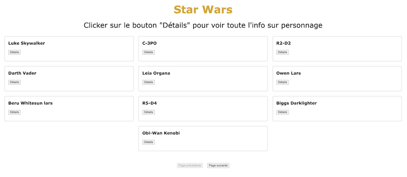
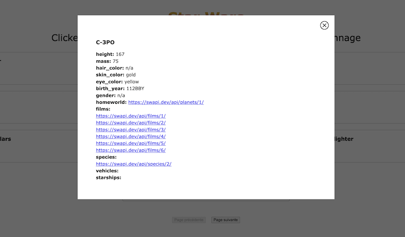

# Test de l'API Star Wars

L'objectif de ce projet pédagogique est de tester l'interaction avec l'API à l'aide de JQuery.

## Les caractéristiques

- Une liste de personnages (10 par page), se charge dynamiquement
- Une fenêtre pop-up avec des données du personnage chargées dynamiquement
- Un bouton "suivant" pour obtenir des 10 caractères suivants de manière dynamique
- un bouton "précédent" pour obtenir dynamiquement des 10 caractères précédents

## La Stack Technique

**Client :** HTML5, CSS, JQuery, JavaScript, Rest API

### --------------------- English version ---------------------

# Testing The Star Wars API

Objective of this educational project is to test interaction with API using JQuery.

## Features

- Characters list (10 per page), loads dynamically
- Pop-up window with character's data loaded dinamically
- Next button to get next 10 characters dynamically
- Previous button to get previous 10 characters dynamically

## Tech Stack

**Client:** HTML5, CSS, JQuery, JavaScript, Rest API

## Screenshots

### --------------------- Home page ---------------------

### --------------------- Popup with hero details ---------------------

### --------------------- Hero page ---------------------

### --------------------- Planet page ---------------------
